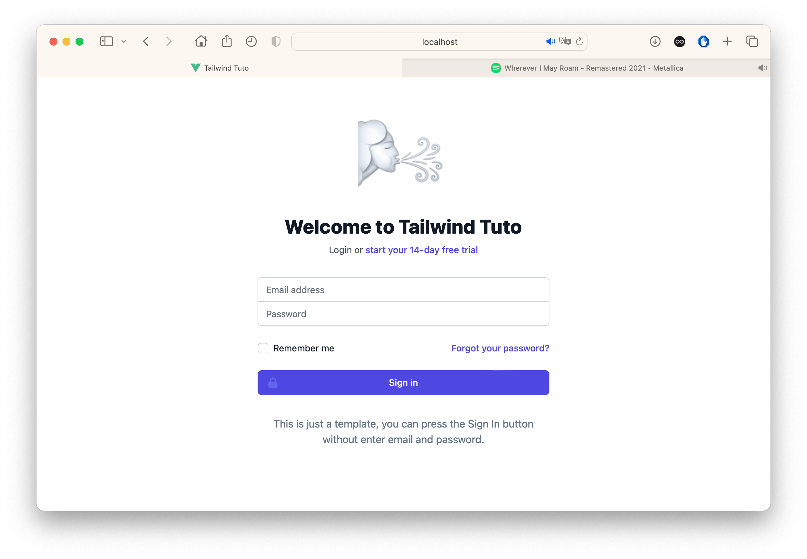
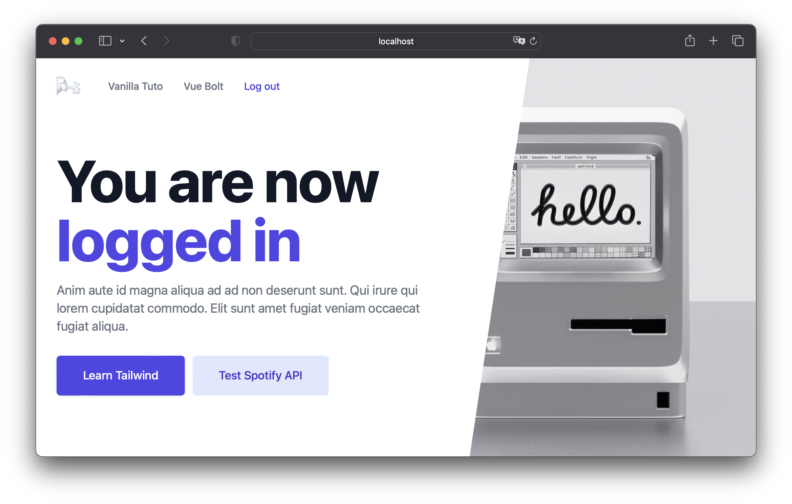

<div align="center">
  <h1>
    <br/>
    🌬
    <br />
    <br />
    Tailwind Tuto
    <br />
    <br />
  </h1>
  <sup>
    <br />
   A Vue 3 Starter Boilerplate with TailwindCSS 3, Vue Router 4, Pinia 2, Vite 5, Sass, Axios, Jest 29 and More.</em>
    <br />
    <br />

[](https://github.com/morellexf13/tailwind-tuto/actions/workflows/build.yml)
[](https://github.com/morellexf13/tailwind-tuto/releases)
[](https://github.com/morellexf13/tailwind-tuto/blob/main/LICENSE)
[](https://www.npmjs.com/package/tailwind-tuto)
[](https://tailwindcss.com)

  </sup>
</div>





<br>

Based on [Vue Bolt](https://github.com/morellexf13/vue-bolt.git) boilerplate
## 💎 Features
  - 💿 Login session handled by Pinia
  - ☀️ Pre-defined classes by TailwindCSS
  - 🎵 Spotify Tracker
    
    1- Create a `.env` file in project's root
    
    2- Add your Spotify Token as below:
    ```
    VITE_SPOTIFY_AUTHORIZATION_BEARER_TOKEN=your_token
    ```

<br>

## 🚀 Install

Install it locally in your project

```bash
npm install

npm run dev
```

<br>

## 🧪 Unit tests

```
npm run test
```
